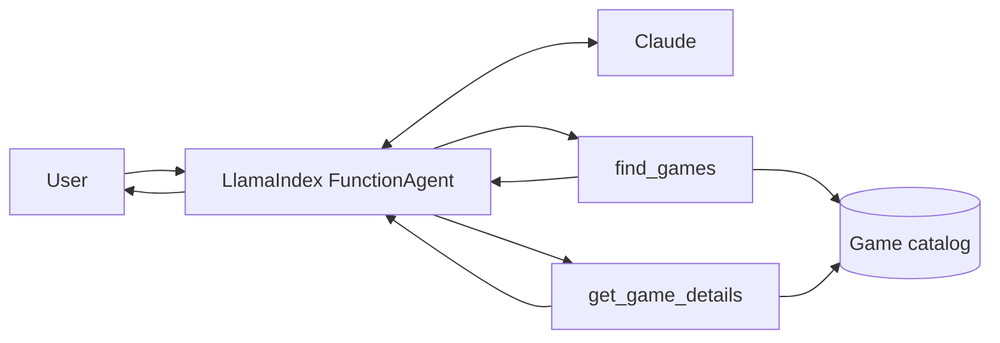

# MeepleMind 🎲🧠

> An AI board game recommendation agent built with LlamaIndex and Claude.

MeepleMind is an experimental **agentic AI** project that helps users choose a board game based on constraints such as the number of players, available time, complexity and play style.

Rather than relying on the LLM's general knowledge, the agent uses dedicated tools to query a structured game catalog and grounds its answers in the returned data. The project is a hands-on exploration of **tool calling, agent design and constrained LLM behaviour** with LlamaIndex.

> 🚧 **Work in progress** — the current version uses a small local catalog while the agent architecture is being developed.

## ✨ Features

- 💬 Natural-language board game requests
- 🔎 Filters games by **player count, maximum play time, style and complexity**
- 🎲 Retrieves details for specific games
- 🛠️ Uses LlamaIndex tools instead of letting the LLM invent game information
- 🧠 Keeps conversational context across turns
- 👀 Streams tool calls and tool results in the CLI for transparency and debugging

## 🧩 How it works



The current agent exposes two tools:

- `find_games` — searches the catalog using player count, available time, style and complexity.
- `get_game_details` — retrieves information about a specific game.

The LLM decides when to call these tools and uses their outputs to formulate the final response.

## 💬 Example

```text
You: We are 4 players and have 30 minutes.

Calling tool: find_games
Arguments: {'players': 4, 'max_time': 30}

MeepleMind: Here are some games that fit your group and available time...
```

## 🛠️ Tech stack

- **Python 3.12+**
- **LlamaIndex**
- **Anthropic Claude**
- **uv**
- **Pyright**
- **Ruff**

## 🚀 Getting started

```bash
git clone https://github.com/dacfortuny/meeplemind.git
cd meeplemind
uv sync
```

Create a `.env` file:

```env
ANTHROPIC_API_KEY=your_api_key_here
```

Run MeepleMind:

```bash
uv run python main.py
```

Type `exit`, `quit` or `bye` to end the conversation.

## 📁 Project structure

```text
meeplemind/
├── data/
│   └── games.json
├── tools/
│   └── games.py
├── agent.py
├── main.py
└── pyproject.toml
```

## 🗺️ Possible next steps

- Expand the game catalog
- Add richer board game metadata
- Improve ranking and recommendation logic
- Add automated tests and agent evaluations
- Build a simple web interface
- Explore external board game data sources

## 📌 Status

🚧 **Work in progress**

MeepleMind is primarily a playground for experimenting with LlamaIndex agents, tool use and grounded LLM responses.
